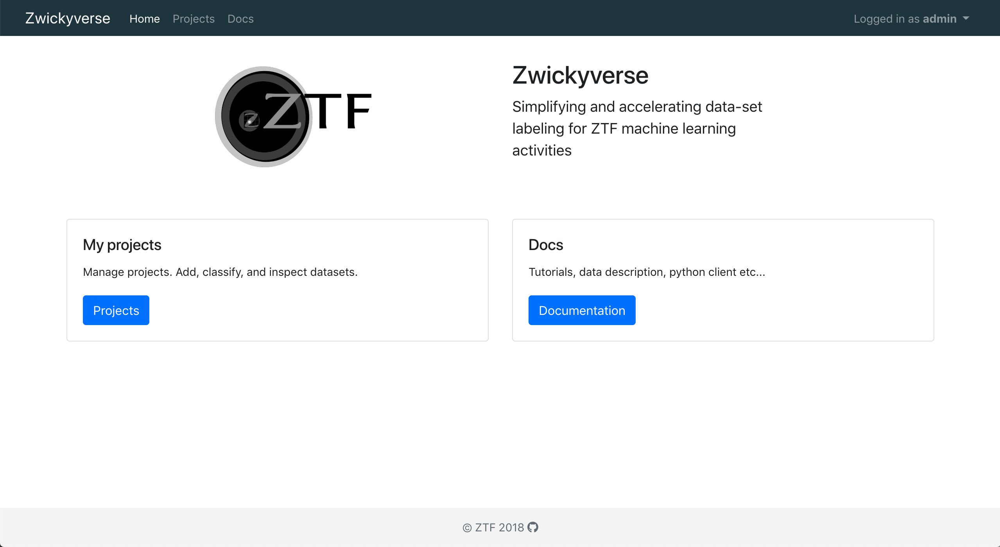
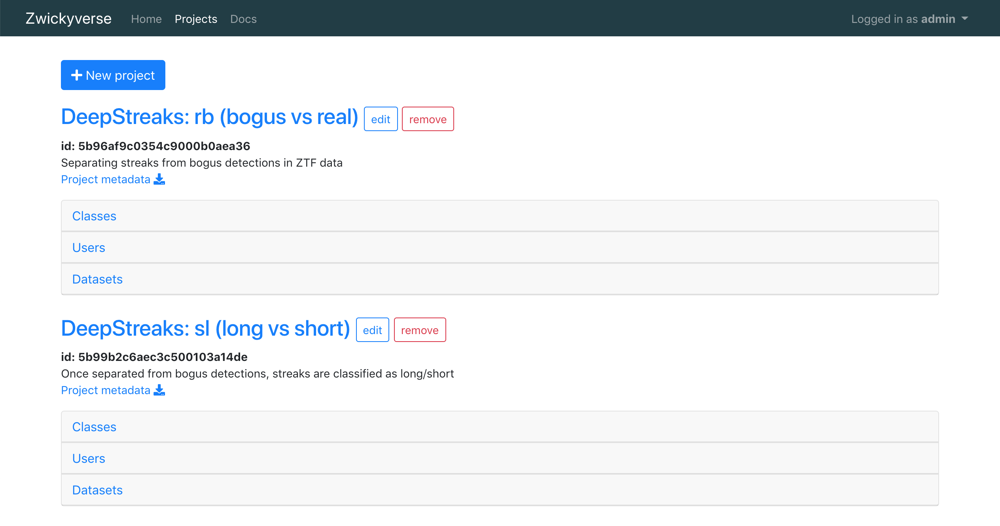
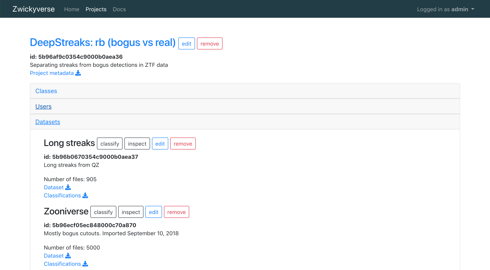
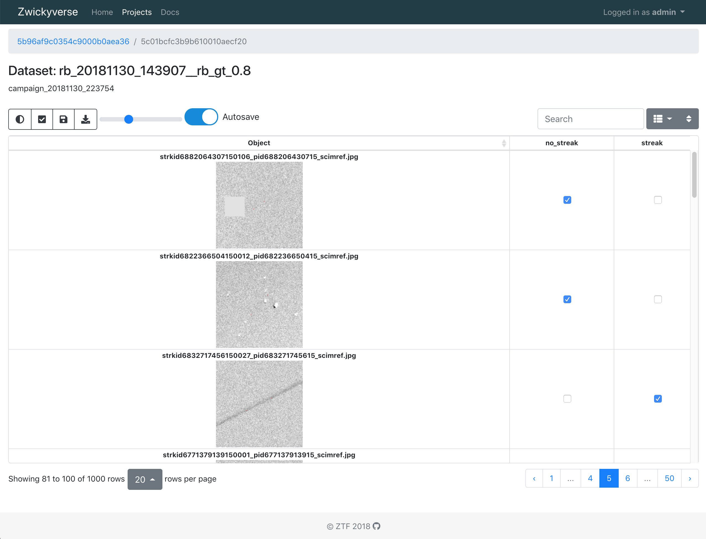

## Zwickyverse: Zooniverse with an artificial human face

_Simplify data-set labeling for machine learning activities_


### Set-up instructions

#### Pre-requisites

Clone the repo and cd to the directory:
```bash
git clone https://github.com/dmitryduev/zwickyverse.git
cd zwickyverse
```

Create `secrets.json` with the `Kowalski` login credentials and admin user/password for the website:
```json
{
  "kowalski": {
    "user": "USER",
    "password": "PASSWORD"
  },
  "database": {
    "admin_username": "ADMIN",
    "admin_password": "PASSWORD"
  }
}
```

#### Using `docker-compose` (for production)

Change `private.caltech.edu` on line 34 in `docker-compose.yml` and line 88 in `traefik/traefik.toml` to your domain. 

Run `docker-compose` to start the service:
```bash
docker-compose up --build -d
```

To tear everything down (i.e. stop and remove the containers), run:
```bash
docker-compose down
```

---

#### Using plain `Docker` (for dev/testing)

If you want to use `docker run` instead:

Create a persistent Docker volume for MongoDB and to store thumbnails etc.:
```bash
docker volume create zwickyverse-mongo-volume
docker volume create zwickyverse-volume
```

Launch the MongoDB container. Feel free to change u/p for the admin, 
but make sure to change `config.json` correspondingly.
```bash
docker run -d --restart always --name zwickyverse-mongo -p 27020:27017 -v zwickyverse-mongo-volume:/data/db \
       -e MONGO_INITDB_ROOT_USERNAME=mongoadmin -e MONGO_INITDB_ROOT_PASSWORD=mongoadminsecret \
       mongo:latest
```

Build and launch the main container:
```bash
docker build --rm -t zwickyverse:latest -f Dockerfile .
docker run --name zwickyverse -d --restart always -p 8000:4000 -v zwickyverse-volume:/data --link zwickyverse-mongo:mongo zwickyverse:latest
# test mode:
docker run -it --rm --name zwickyverse -p 8000:4000 -v zwickyverse-volume:/data --link zwickyverse-mongo:mongo zwickyverse:latest
```

The service will be available on port 8000 of the `Docker` host machine


---

### Python client library `zwickyverse`

Install the client library [zwickyverse.py](https://github.com/dmitryduev/zwickyverse/blob/master/zwickyverse.py), 
with `pip` into your environment:

```bash
pip install git+https://github.com/dmitryduev/zwickyverse.git
```

`zwickyverse` is very lightweight and only depends on `pymongo` and `requests`.

See documentation for details about library usage.

---

### Screenshots






